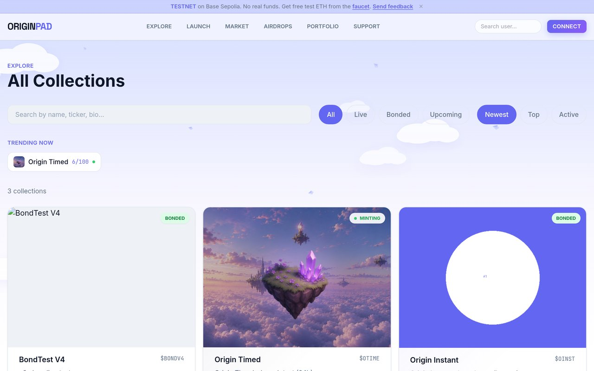
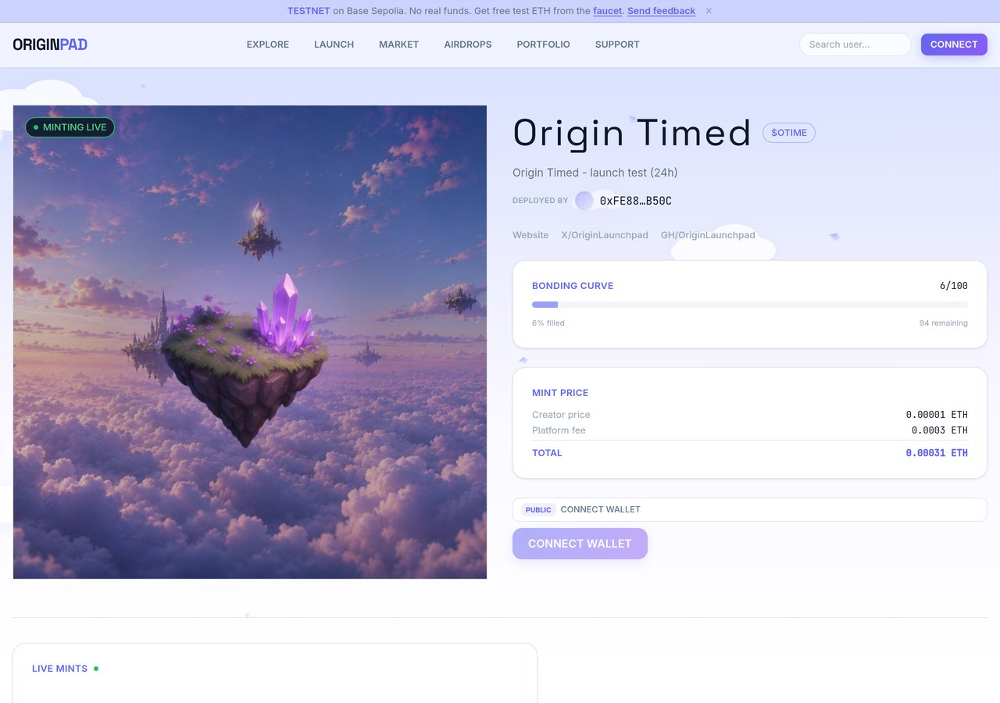
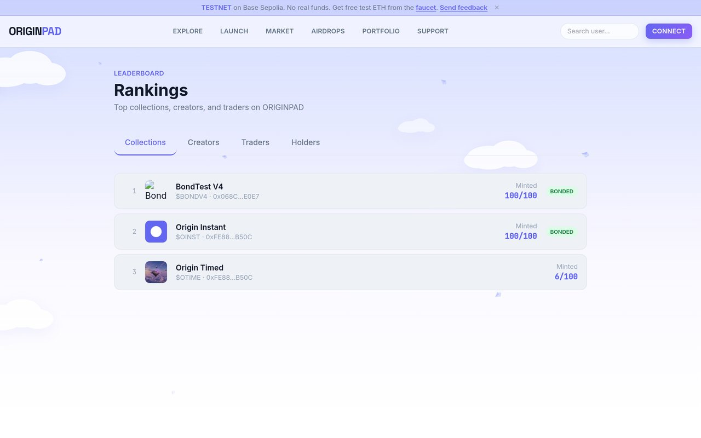

<div align="center">


# OriginPad

### The launchpad built so you cannot get rugged.

NFT x Token launchpad on Base. Upload art, mint out a 100-NFT bonding curve, and an ERC-20 token deploys automatically with its liquidity locked. Every mechanism normally used to rug a launch is removed or hard-coded on-chain.

[](https://base.org)
[](https://originpad.live)
[](./LITEPAPER.md)
[](https://x.com/OriginLaunchpad)
[](https://originpad.live)

[Website](https://originpad.live) . [Litepaper](./LITEPAPER.md) . [X / Twitter](https://x.com/OriginLaunchpad)

</div>

---

## What is OriginPad

OriginPad turns a photo collection into a complete on-chain economy in one flow: an NFT drop, then a live token with locked liquidity, then a reward cycle that pays holders and burns supply. Creators launch in minutes, holders get protection that is enforced by contracts rather than promised in a Discord.

It is live now on Base Sepolia testnet, with a public launch and the path to mainnet underway.

## The problem we solve

Most token and NFT launches fail the same handful of ways. OriginPad closes each one at the contract level:

| Common rug | How OriginPad prevents it |
|---|---|
| Liquidity rug pulls | Token liquidity is seeded from the bonding pool and locked. The team cannot pull it. |
| Team dumps in week one | Distribution is fixed in code, with half of supply routed to a vault on a hard-coded schedule. |
| Rarity sniping by bots | Rarity is assigned only at sellout, from a block mined after the final mint. The last minter cannot grind for the Mythic. |
| Allowlist bypass and bot floods | Up to four allowlist phases with on-chain merkle roots. |
| Malicious marketplace approvals | A built-in marketplace and in-app swap mean no external approvals to drain wallets. |
| Mint proceeds vanishing | Proceeds flow on-chain into the bonding pool, not to an EOA. |

## How it works

1. **Launch.** A creator uploads 3 to 6 photos (one per rarity tier), sets a mint price, toggles an optional token, and configures up to four allowlist phases.
2. **Mint.** 100 NFTs mint on a bonding curve. Rarity is assigned at sellout and either revealed instantly or hidden behind a mystery photo for 24h or 7d.
3. **Bond.** The 100th mint triggers the token factory. An ERC-20 (1B supply) deploys and a Uniswap V4 pool opens with liquidity seeded from the bonding pool and locked.
4. **Trade.** The built-in NFT marketplace unlocks and the token trades through an in-app swap on the V4 pool. No external approvals.
5. **Reward.** Half of supply locks into a vault. Across five epochs (day 1, 7, 14, 28, 56) it airdrops to holders and burns 9% each cycle, steadily reducing supply.

## Key features

- **Optional token per launch.** Creators can ship an NFT-only collection or a full NFT plus token launch.
- **Creator-set swap fee.** When a token is enabled, the creator picks a swap fee from 1.5% (base) up to 3.5%, enforced by a Uniswap V4 hook.
- **Anti-snipe reveals.** Rarities shuffle at sellout; reveal can be instant or delayed by 24h or 7d.
- **Verified identity.** Creators and holders connect with X to verify their real handle, so no one can impersonate a known account.
- **Live mint feed and leaderboards.** Real-time activity and rankings by verified username.

## Screenshots

| Explore collections | Mint a collection |
|---|---|
|  |  |



## Fee model

| Event | Fee | Goes to |
|---|---|---|
| Mint | 0.0003 ETH flat per NFT | Platform treasury |
| Mint price | Creator-set | Bonding pool |
| NFT buy / sell (post-bonding) | 1.5% | Split below |
| Token buy / sell | 1.5% to 3.5% (creator-set) | Split below |

**Fee split** (proportions, shown for the 1.5% base): creator 1.0%, platform 0.2%, maintenance 0.2%, airdrop vault 0.1%. The same proportions hold at any swap fee up to 3.5%.

## Tech stack

| Layer | Tech |
|---|---|
| Chain | Base (OP Stack L2) |
| Contracts | Solidity 0.8.26, OpenZeppelin v5 |
| Token DEX | Uniswap V4 (PoolManager + custom fee hook) |
| Frontend | Next.js 14, TypeScript, Tailwind, Wagmi v2 + viem |
| Storage | IPFS via Pinata |
| Indexer | Node.js oracle (viem) for PnL and airdrop lists |
| Tooling | Hardhat |

## Repository layout

```
originpad/
├── contracts/   Solidity smart contracts (Hardhat)
├── frontend/    Next.js 14 app (Wagmi v2 + viem)
└── backend/     Node.js oracle (trade indexer + airdrop submitter)
```

## Run it locally

```bash
# Contracts
cd contracts && npm install
cp .env.example .env        # set PRIVATE_KEY + BASESCAN_API_KEY
npm run deploy:testnet      # Base Sepolia

# Frontend
cd ../frontend && npm install
cp .env.local.example .env.local
npm run dev                 # http://localhost:3000

# Oracle
cd ../backend && npm install
cp .env.example .env
npm start
```

## Deployed contracts

Live and verified on **Base Sepolia** (chain id 84532). Anyone can inspect them on-chain:

| Contract | Address |
|---|---|
| Launchpad | [`0x808090Ed676D43d8267e784A3Aa3Ac1C3072F51C`](https://sepolia.basescan.org/address/0x808090Ed676D43d8267e784A3Aa3Ac1C3072F51C) |
| Vault | [`0x856B283164Bd530Ae8E58DA50501df93E944D667`](https://sepolia.basescan.org/address/0x856B283164Bd530Ae8E58DA50501df93E944D667) |
| Token Factory | [`0x8293632E607d1142682f7509e6878D8B95cb348e`](https://sepolia.basescan.org/address/0x8293632E607d1142682f7509e6878D8B95cb348e) |
| Uniswap V4 Fee Hook | [`0x0E127CaFeA5c480dB9018C1606dD5734D544C0Cc`](https://sepolia.basescan.org/address/0x0E127CaFeA5c480dB9018C1606dD5734D544C0Cc) |
| Swap Router | [`0x148f17BDabf9FCe97C6e4E148A7037De48403de9`](https://sepolia.basescan.org/address/0x148f17BDabf9FCe97C6e4E148A7037De48403de9) |

Mainnet addresses will be published here at launch.

## Roadmap to mainnet

- Formal third-party security audit
- Expanded automated test coverage
- Subgraph indexing for scale
- Multisig-controlled platform treasury
- Oracle redundancy across multiple nodes
- Mainnet launch on Base

## Links

- Website: https://originpad.live
- Litepaper: [LITEPAPER.md](./LITEPAPER.md)
- X / Twitter: https://x.com/OriginLaunchpad

---

<div align="center">
<sub>OriginPad. All rights reserved.</sub>
</div>
